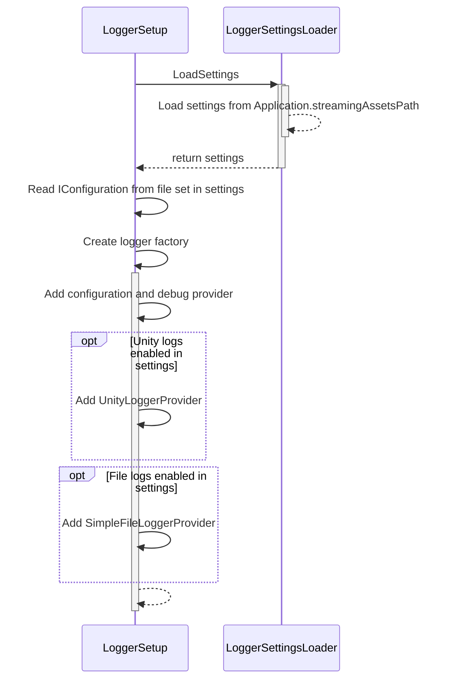
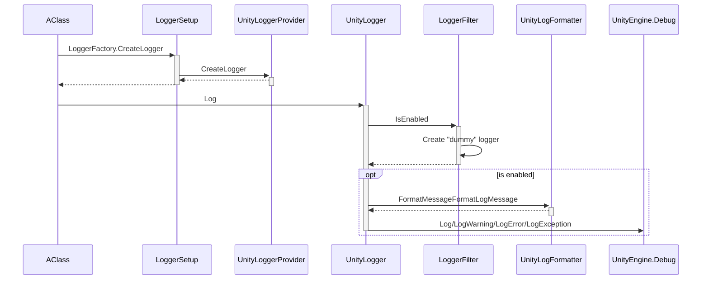
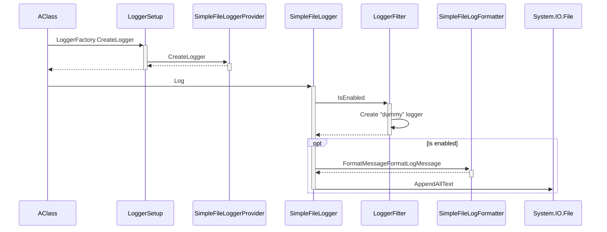

# Technical documentation

## Class list
- **LoggerSetup.cs**: The package entry point, creates loggers and keeps track of them.
- **LoggerSettings.cs**: All settings for the loggers (both console and file).
- **LoggerSettingsLoader.cs**: Loads and save the settings from a Json file in (Application.streamingAssetsPath).
- **LoggerFilder.cs**: Provide a way to filter logs with default C# class base filters (More info in the [LoggerFilter section](#loggerfiltercs---a-workaround)).
  
- UnityLogger/**UnityLoggerProvider.cs**: Provides a UnityLogger for each category (namespace+classname).
- UnityLogger/**UnityLogger.cs**: Logs the messages to the Unity console.
- UnityLogger/**UnityLogFormatter.cs**: Formats the log using the format provided in the *Unity console* section of the LoggerSettings.
  
- SimpleFileLoader/**SimpleFileLoaderProvider**: Provides a SimpleFileLoader for each category (namespace+classname).
- SimpleFileLoader/**SimpleFileLoader.cs**: Logs the messages to a file.
- SimpleFileLoader/**SimpleFileLogFormatter.cs**: Formats the log using the format provided in the *File* section of the LoggerSettings.

## Flow
### Start

### Unity console log
Unity console logger and File logger works the same, except for the Log method.

### File log
Unity console logger and File logger works the same, except for the Log method.

## LoggerFilter.cs - a workaround
I did not find a way to get the default category filtering in my custom loggers. So the class is a workaround to get access to this filtering "outside" of my custom loggers.

The LoggerFilter class creates a "default" LoggerFactory that only create a configuration. Loggers are stored in a dictionary for easier access.

My loggers IsEnabled method simply calls the LoggerFilter. LoggerFilter will then get or create the "fake default" logger and call IsEnabled on it to tell my logger if it should be enabled or not for this category.