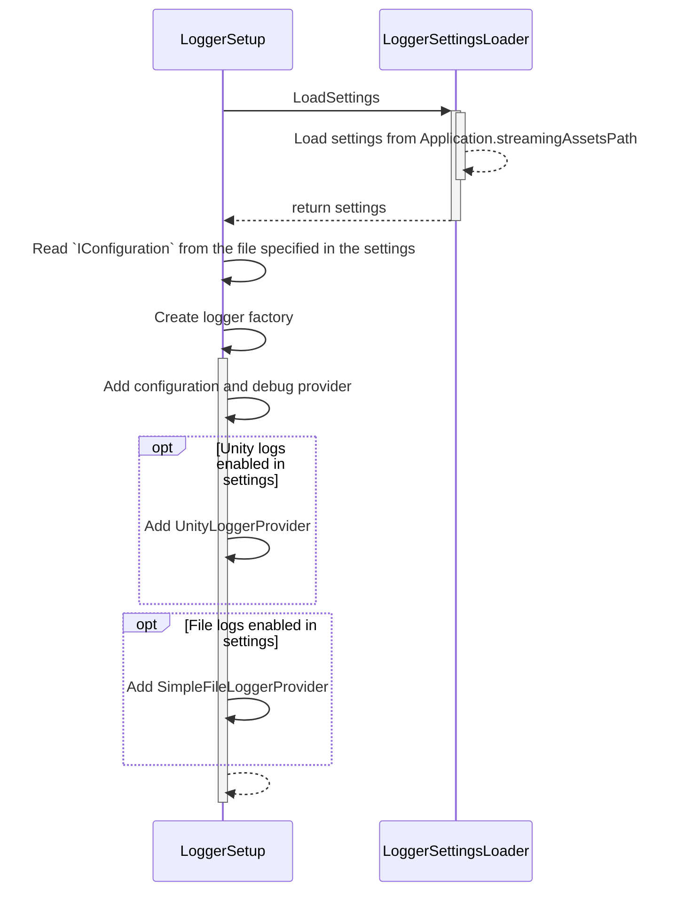
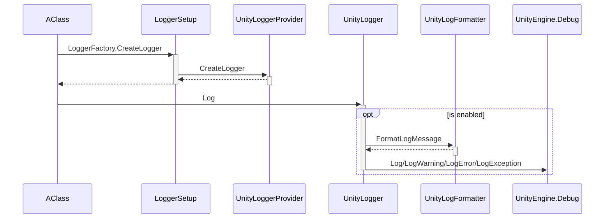
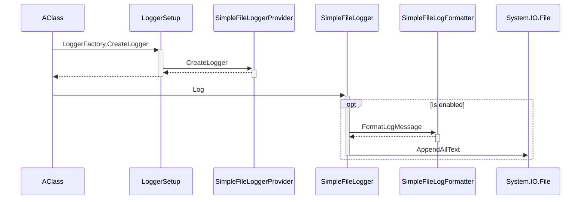

# Technical Documentation

## Class list
- **LoggerSetup.cs**: The package entry point. Creates loggers and keeps track of them.
- **LoggerSettings.cs**: All settings for the loggers (both console and file).
- **LoggerSettingsLoader.cs**: Loads and saves settings from a JSON file in `Application.streamingAssetsPath`.

- UnityLogger/**UnityLoggerProvider.cs**: Provides a UnityLogger for each category (namespace + class name).
- UnityLogger/**UnityLogger.cs**: Logs messages to the Unity console.
- UnityLogger/**UnityLogFormatter.cs**: Formats log messages using the format provided in the *Unity console* section of the `LoggerSettings`.

- SimpleFileLoader/**SimpleFileLoaderProvider.cs**: Provides a SimpleFileLoader for each category (namespace + class name).
- SimpleFileLoader/**SimpleFileLoader.cs**: Logs messages to a file.
- SimpleFileLoader/**SimpleFileLogFormatter.cs**: Formats log messages using the format provided in the *File* section of the `LoggerSettings`.

## Flow
### Start

### Unity console log
The Unity console logger and the file logger work the same way, except for the Log method.

### File log
The Unity console logger and the file logger work the same way, except for the Log method.
